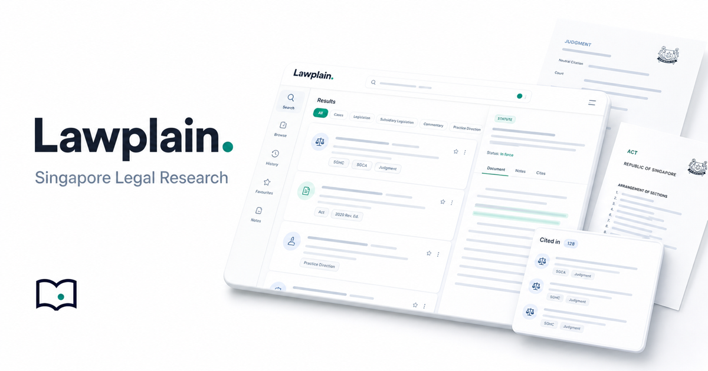

<p align="center">
  
</p>

<h1 align="center">Lawplain</h1>

<p align="center">
  <strong>Plain-English search across Singapore law.</strong>
</p>

<p align="center">
  Judgments, statutes, subsidiary legislation, Hansard, bills and practice
  directions — one fast search box, plus an agent that reads the corpus and
  writes a cited answer.<br/>
  <strong>Ask a question. Get the law, with citations.</strong>
</p>

<p align="center">
  <a href="https://lawplain.com"></a>
  
  
  
</p>

<p align="center"><sub>Read-only legal <em>information</em>, not legal advice.</sub></p>

---

## What is it?

Lawplain is a research surface over the Singapore legal corpus. Two ways in:

- **Search** — type a few words; full-text results (SQLite FTS5 + bm25) across
  judgments, statutes, subsidiary legislation, Hansard, bills and practice
  directions, served from a read-only Cloudflare D1 API with edge caching and
  read replicas.
- **Ask Lawplain** — ask in plain English (*"What must a plaintiff prove in a
  defamation claim?"*). A [`graff`](https://github.com/justrach/codegraff) agent
  runs real searches against the corpus, iterates over results, and streams back
  a **cited** answer — each thread saved at its own `/ask/[id]` URL you can
  return to.

> **Not a lawyer?** That's fine. Ask in plain words; Lawplain finds the cases and
> sections and tells you what they say. It cites everything and won't fabricate.

---

## How it fits together

```
        ┌─ Search ─▶ sgjudge API  (Cloudflare Worker + D1 / FTS5)
browser ┤                edge cache · read replicas (D1 Sessions API)
        └─ Ask ───▶ /api/ask ─▶ graff agent  (hosted in a Durable Object)
                         │  bash + curl ▶ backend.lawplain.com
                         ▼
                 Server-Sent Events ─▶ streaming, cited answer
```

- **Frontend** — Next.js (App Router) on Cloudflare Workers via OpenNext.
  Source and full setup in [`lawbook/`](lawbook/README.md).
- **Backend** — `sgjudge`, a read-only REST API over Cloudflare D1 + FTS5 at
  `backend.lawplain.com`.
- **Agent** — `graff` (codegraff) drives the corpus as its tool surface; long
  runs live in a Durable Object so you can navigate away and come back to a
  finished answer.

---

## Stack

| Layer | Tech |
| --- | --- |
| UI | Next.js App Router · React Server Components |
| Runtime | Cloudflare Workers (OpenNext) · Durable Objects · KV |
| Auth | Better Auth (username / password) on D1 |
| Search | sgjudge REST API · Cloudflare D1 · SQLite FTS5 + bm25 |
| Agent | `graff` / `@codegraff/sdk` · Server-Sent Events |

---

## Local development

```sh
cd lawbook
npm install
npm run dev          # http://localhost:3000
```

Full setup — the Ask agent (`graff` install + a model key), Better Auth, and the
D1 migrations — lives in **[lawbook/README.md](lawbook/README.md)**.

Deploy to Cloudflare:

```sh
cd lawbook
npm run cf:build && npx wrangler deploy
```

---

## Legal

Lawplain provides read-only legal **information**, not legal advice. The Ask
agent is instructed to cite its sources and to never fabricate citations or
section numbers; if the corpus does not contain the answer, it says so. Always
verify against the primary source before relying on anything here.
